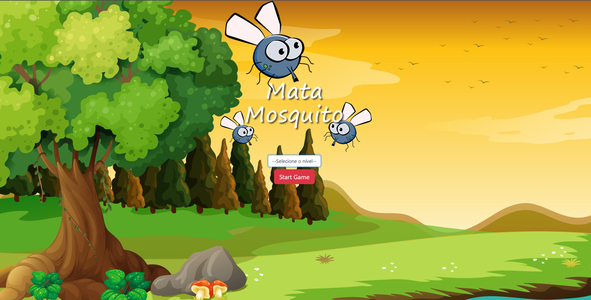
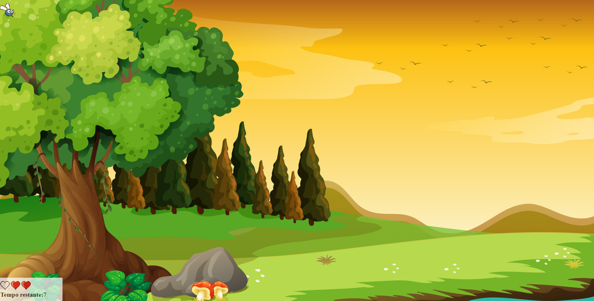
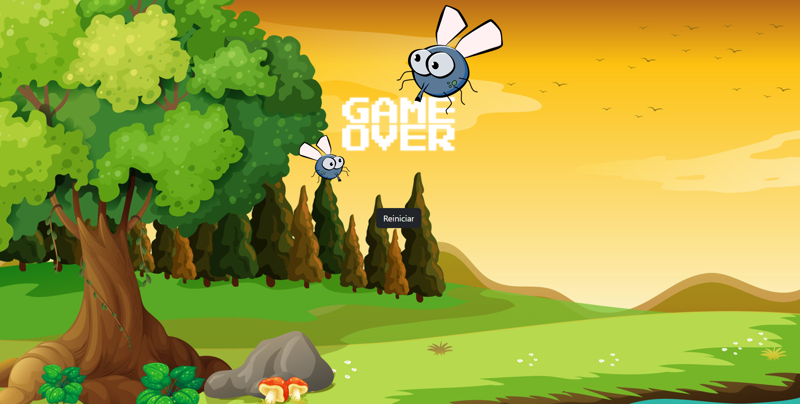

# Game-fly-swatter

## Objetivo  do jogo "Mata Mosquito"

- Colocar em pratica conhecimentos adiquiridos nos estudos da linguagem javascript;
- Colocar em pratica meu Html ;
- Colocar em Pratica meu Css ;
- Ver os conceitos que aprendemos até então, dentro de um contexto pratico mais proximo do mundo real.

#
## Jogabilidade do game

- Na pagina inicial podemos ver um seletor de nível de dificuldade:
  
  - Níveis:
    - Normal 
    - Difícil
    - Chuck Norris
  - Após escolher o nivel clique em "Satrt Game"
#
- Na pagina do jogo vamos ter que nos atentar nos corações que simbolizam a vida do jogador e no tempo maximo de cada partida, o nível vai influenciar na velocidade em que a mosca e criada e retira do senario do jogo. Toda vez que um mosquito sumir antes que você mate-o, você vai perder um coração que simboliza suas vidas e apos peder todos voce vaipara a pagina de game over. Caso fique vivo ate o final do tempo maximo de cada partida você saira vitorioso do jogo.
   

   - pagina de Game Over
    

    - pagina da vitória
    
    
#
## Para jogar o game clique no link

<a href="http://gameflyswatter.rf.gd/index.html" target="_blank">Game Fly Swatter</a>
